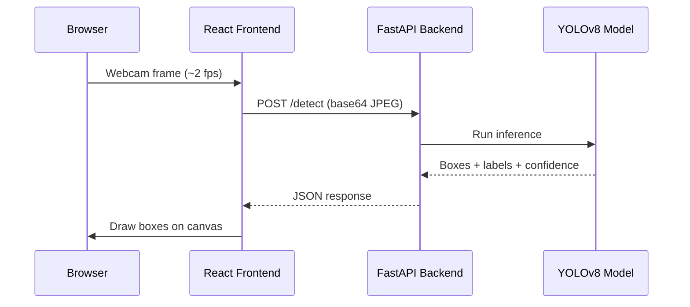

<div align="center">


<p>


</p>

**[🎥 Live Demo](https://real-time-object-detection-delta.vercel.app/)** &nbsp;•&nbsp; **[⚙️ Backend API](https://real-time-object-detection-cnfp.onrender.com)**

</div>

<br/>

## What it does

Point your webcam at anything, and it detects objects in real time — right in the browser. No install, no app, just open the link.

```
webcam frame → FastAPI → YOLOv8 inference → bounding boxes → drawn live on canvas
```

<br/>

## Stack

<div align="center">


</div>

| Layer | Tech |
|---|---|
| **Detection model** | YOLOv8 (nano) via Ultralytics |
| **Backend** | FastAPI, deployed on Render |
| **Frontend** | React + Vite, deployed on Vercel |
| **Vision** | `getUserMedia` webcam capture, canvas overlay for live bounding boxes |

<br/>

## Try it

1. Open the **[live demo](https://real-time-object-detection-delta.vercel.app/)**
2. Click **Start Detection**
3. Allow camera access
4. Watch it detect people, phones, and everyday objects in real time

> ⏳ First request may take ~50s to wake up — the backend runs on Render's free tier, which sleeps after inactivity.

<br/>

## Run it locally

<details>
<summary><b>Backend</b> (click to expand)</summary>

```bash
cd backend
python3 -m venv venv
source venv/bin/activate        # Windows: venv\Scripts\activate
pip install fastapi "uvicorn[standard]" ultralytics pillow numpy python-multipart
python -m uvicorn main:app --reload --port 8000
```

First run auto-downloads the `yolov8n.pt` weights (~6 MB).
Check it's alive: `http://localhost:8000/health` → `{"status": "ok"}`

</details>

<details>
<summary><b>Frontend</b> (click to expand)</summary>

```bash
cd frontend
npm install
npm run dev
```

Open `http://localhost:5173`, click **Start Detection**, allow camera access.

</details>

<br/>

## How it works



<br/>

## Roadmap

- [ ] Fine-tune the model for a specific use case (e.g. safety-gear detection)
- [ ] Add a stats view — detections over time, most common objects
- [ ] Tighten backend CORS to only allow the deployed frontend origin

<br/>

<div align="center">

Built by **[Manish M P](https://github.com/manishkshtriya)** — extending computer vision research from a CV internship at NITK Surathkal into a shipped product.

</div>
